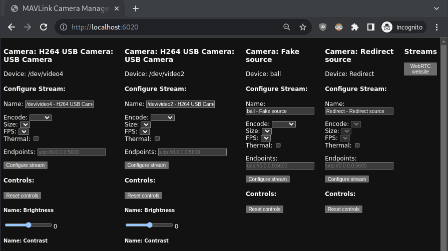
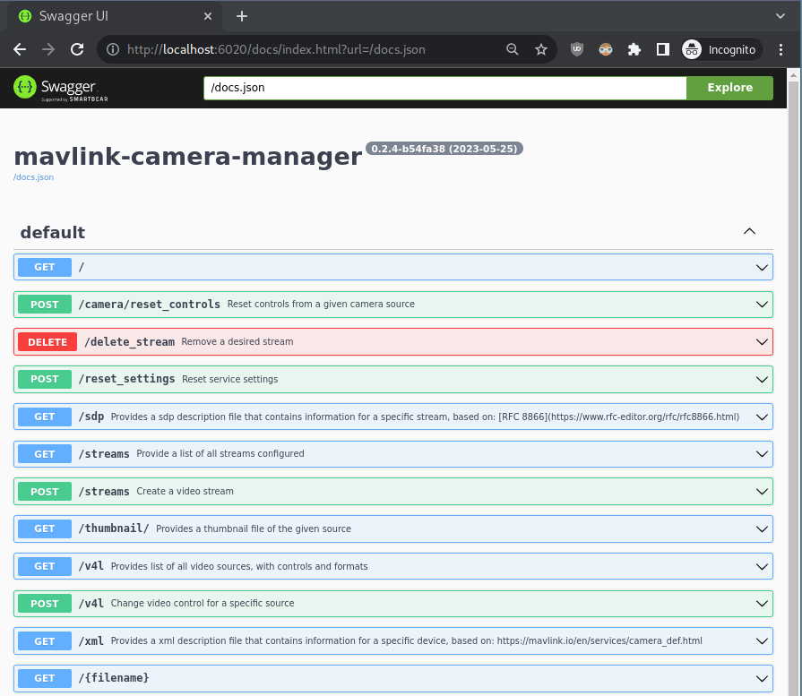
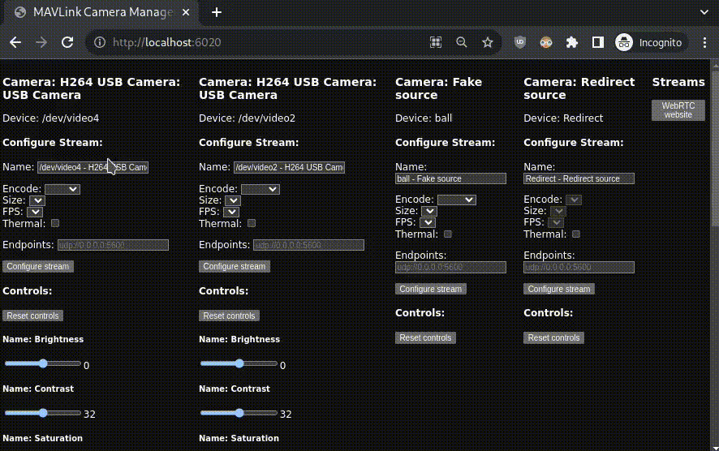

<!-- TODO: Place a logo below -->
<!-- <p align="center">[ A LOGO HERE ]</p> -->
<h1 align="center">
   Mavlink Camera Manager
</h1>
<h4 align="center">
   An extensible cross-platform camera server built on top of GStreamer and Rust-MAVLink
</h4>

---

[](https://github.com/mavlink/mavlink-camera-manager/actions)
[](https://crates.io/crates/mavlink-camera-manager)
[](https://crates.io/crates/mavlink-camera-manager)
[](https://docs.rs/mavlink-camera-manager)

## Key Features

- Create and manage streams:
  - from local devices, like most USB cameras (using video4linux)
  - from remote devices, like most IP cameras
  - with supported encodings: H264, MJPG, Raw (YUYV)
- REST API for full control over streams and easy integrations
  - With Swagger UI always available for easy development <sup>([What is this?](https://swagger.io/tools/swagger-ui/))</sup>
- Configure video4linux camera controls, like brightness, saturation, etc.
- SDP files available, allowing easy access from video players like [VLC](https://www.videolan.org/)
- Redirect 3rd party streams, advertising them via MAVLink protocol
- MAVLink protocol using [rust-mavlink](https://github.com/mavlink/rust-mavlink):
  - Work with multiple cameras
  - Interface video4linux camera controls
- WebRTC-ready, for modern control stations
- Remember configured streams
- Rotated logs with configurable path and verbosity level
- Generate thumbnails/snapshots for streams from local devices
- Configurable via CLI arguments
- Cross-platform, deployed for x64 and armv7 Linux

## Table of Contents

- [Key Features](#key-features)
- [Table of Contents](#table-of-contents)
- [How to use it](#how-to-use-it)
  - [1. Downloading](#1-downloading)
  - [2. Installing](#2-installing)
  - [3. Running](#3-running)
- [Quick test guide](#quick-test-guide)
  - [Receiving a stream from a MAVLink ground control station like QGroundControl](#receiving-a-stream-from-a-mavlink-ground-control-stations-like-qgroundcontrol)
  - [Receiving a stream from a GStreamer pipeline](#receiving-a-stream-from-a-gstreamer-pipeline)
- [How to build it](#how-to-build-it)
- [License](#license)
- [Project origins](#project-origins)

## How to use it

### 1. Downloading

Download the mavlink-camera-manager binary for your architecture from our [releases](https://github.com/mavlink/mavlink-camera-manager/releases), or build it from sources as [described here](#how-to-build-it)

### 2. Installing

- First, install the required runtime dependencies (assuming a Ubuntu-based distro):

```Bash
sudo apt update -y && \
sudo apt install -y --no-install-recommends \
   libgstreamer1.0-0 \
   libgstreamer-plugins-base1.0-0 \
   libgstreamer-plugins-bad1.0-0 \
   libgstrtspserver-1.0-0 \
   gstreamer1.0-x \
   gstreamer1.0-nice
```

_note: GStreamer needs to be at least version `1.16.0`. You can check it by running `gst-launch-1.0 --version`._

- Extract the zip
- optionally, put the folder to your Linux PATH

### 3. Running

After [the installation](#2-installing), the binary can be run by calling it from the terminal, as simple as:

```Bash
mavlink-camera-manager --mavlink=tcpout:0.0.0.0:14000 --verbose
```

At this point, the API should be ready. By default, it's accessible from any computer in the same network at port `6020`, but it is customizable using the `--rest-server` CLI argument.

For more information about the CLI arguments, `mavlink-camera-manager --help` will give a list of accepted parameters for your version.

- Along with the REST API, a simple management interface is available at http://localhost:6020, in which streams can be created and managed:
  

- For developers, the Swagger UI with documentation for the entire REST API can be found at http://localhost:6020/docs
  

## Quick test guide

The short clip below shows how an H264 UDP stream can be configured using the management interface, and how it can be accessed as a WebRTC stream.



<!-- TODO: #### Receiving a stream from a video player like VLC -->

#### Receiving a stream from a MAVLink ground control station like QGroundControl

The video should automatically popup if you are using any modern GCS, like QGroundControl, that has support for MAVLink camera messages.

1. Start `mavlink-camera-manager`
2. Start `mavproxy` or `sim_vehicle` with a **TCP server** at `5777` (mavlink-camera-manager's default can be changed via the CLI argument `--mavlink`)
3. Open your Ground Control Station
4. Done

#### Receiving a stream from a GStreamer pipeline

1. Start `mavlink-camera-manager`
2. Run the following pipeline:

- If **RTSP** (any encoding):

```Bash
gstreamer-launch-1.0 rtspsrc location=$RTSP_ADDR latency=0 \
   ! decodebin
   ! fpsdisplaysink sync=false
```

- If **UDP** (H264 only):

```Bash
gstreamer-launch-1.0 udpsrc port=$PORT \
   ! application/x-rtp,payload=96 \
   ! rtph264depay \
   ! avdec_h264 discard-corrupted-frames=true \
   ! videoconvert
   ! fpsdisplaysink sync=false
```

## How to build it

_This section assumes a Ubuntu 22.04, adaptation will be necessary for other distros._

1. Install the development dependencies:

```Bash
sudo apt update -y &&\
sudo apt install -y --no-install-recommends \
   libunwind-dev \
   libclang-dev \
   libssl-dev \
   pkg-config \
   build-essential \
   curl \
   gnupg \
   ca-certificates \
   git \
   libmount-dev \
   libsepol-dev \
   libselinux1-dev \
   libglib2.0-dev \
   libgudev-1.0-dev \
   gstreamer1.0-tools \
   gstreamer1.0-nice \
   libgstreamer1.0-dev \
   libgstreamer-plugins-base1.0-dev \
   libgstreamer-plugins-bad1.0-dev \
   libgstrtspserver-1.0-dev
```

2. Install cargo if not available <sup>([official instructions here](https://rustup.rs/))</sup>

3. Install NodeJS greater or equal to 19  <sup>([official instructions here](https://github.com/nodesource/distributions#installation-instructions))</sup>, and the latest Yarn <sup>([official instructions here](https://classic.yarnpkg.com/lang/en/docs/install/#debian-stable))</sup>, as shown below:
```Bash
curl -fsSL https://deb.nodesource.com/gpgkey/nodesource-repo.gpg.key \
  | sudo gpg --dearmor -o /usr/share/keyrings/nodesource.gpg &&\
echo "deb [signed-by=/usr/share/keyrings/nodesource.gpg] https://deb.nodesource.com/node_20.x nodistro main" \
  | sudo tee /etc/apt/sources.list.d/nodesource.list &&\
curl -fsSL https://dl.yarnpkg.com/debian/pubkey.gpg \
  | sudo gpg --dearmor -o /usr/share/keyrings/yarnkey.gpg &&\
echo "deb [signed-by=/usr/share/keyrings/yarnkey.gpg] https://dl.yarnpkg.com/debian stable main" \
  | sudo tee /etc/apt/sources.list.d/yarn.list &&\
sudo apt-get update -y &&\
  sudo apt-get install -y --no-install-recommends \
  nodejs \
  yarn
```

4. Clone this repository and enter it

```Bash
git clone https://github.com/mavlink/mavlink-camera-manager.git &&\
cd mavlink-camera-manager
```

5. Build it with cargo:

```Bash
cargo build --release

```

_note: If the compilation fails to find one of these packages, make sure that they are visible for `pkg-config`, which may be necessary to set `PKG_CONFIG_PATH` environment variable._

## License

This project is licensed under the [MIT License](/LICENSE).

## Project origins

The Mavlink Camera Manager project originated as a personal experiment by [@patrickelectric](github.com/patrickelectric/), driven by the need to address a critical challenge in remotely operated vehicles – effectively managing and providing camera streams to the topside computer. At the time, there was a noticeable absence of open-source alternatives, which motivated the project's inception.

Over time, the project gained recognition and was officially embraced by [**Blue Robotics**](https://github.com/bluerobotics) as a core development effort. It became an integral part of their operating system, BlueOS, and was widely distributed worldwide. The adoption of the Mavlink Camera Manager by Blue Robotics served as a testament to its capabilities and value.

Due to increasing interest from other developers and integrators, the project was transferred to the [**MAVLink organization**](https://github.com/mavlink) on May 25, 2023.
